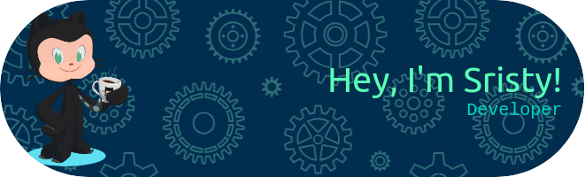

  

<h3>About Me</h3>
Hello there! I’m Sristy 👋, a passionate developer 💻 and enthusiastic open-source contributor 🌟. I love building scalable applications 🚀 and diving into new technologies to tackle real-world challenges 🔍. My journey in programming started with a fascination for crafting elegant solutions ✨ and has grown into a deep-seated passion for software development ❤️. Feel free to explore my projects and join me on this exciting journey! 🚀🌍

<h3>Tech Stack</h3>
Technologies I work with:

  
                     

<h3>Get in Touch</h3>

I'm currently exploring new opportunities and collaborations. If you're working on something exciting or looking for a motivated developer to join your team, feel free to reach out. Let's connect and build something awesome together!
 
 
  &nbsp;&nbsp;
     &nbsp;&nbsp;
     &nbsp;&nbsp;
    

<h3>  Github Trophies: </h3>

  <a href="https://github.com/sristy17">
 <!-- Trophies -->
    

  <h3 align="left">  My Stats: </h3>
  
 

   
    <!-- Top languages by commit -->
    
    <!-- Top languages by repo -->
    
    <!-- Histogram of Commits -->
    
    <!-- Graph of Commits -->
    
  </a>

